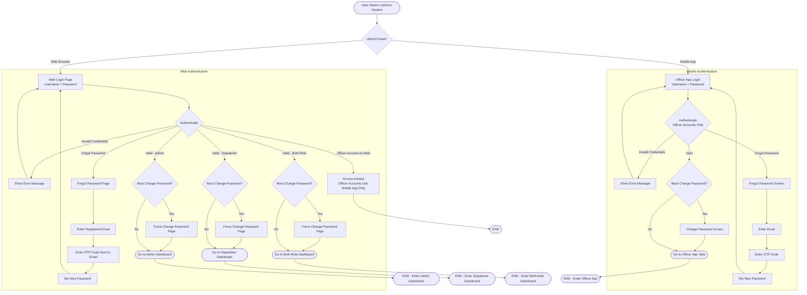
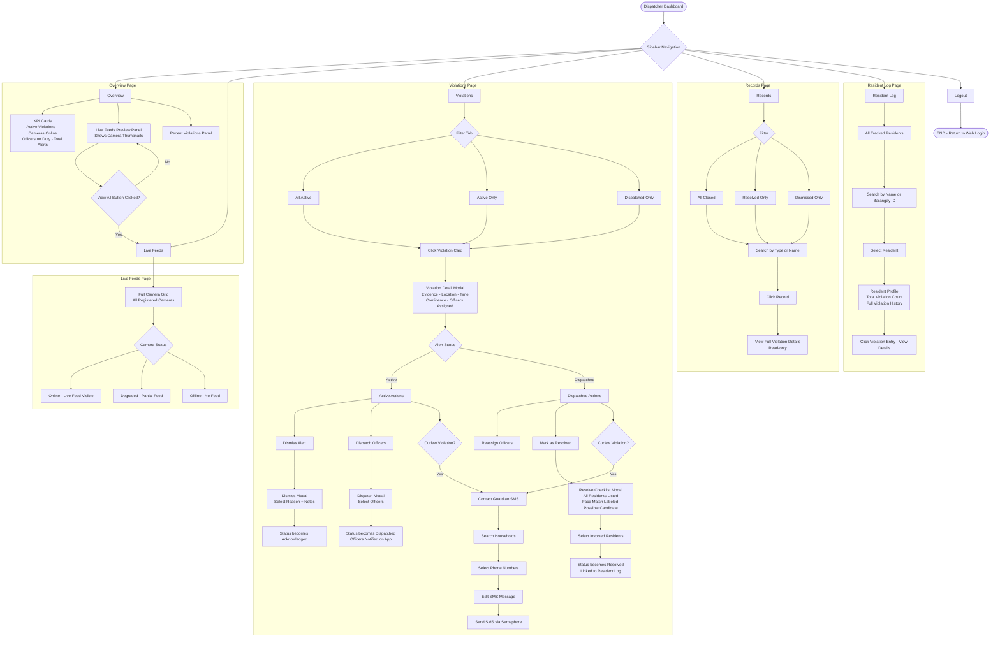
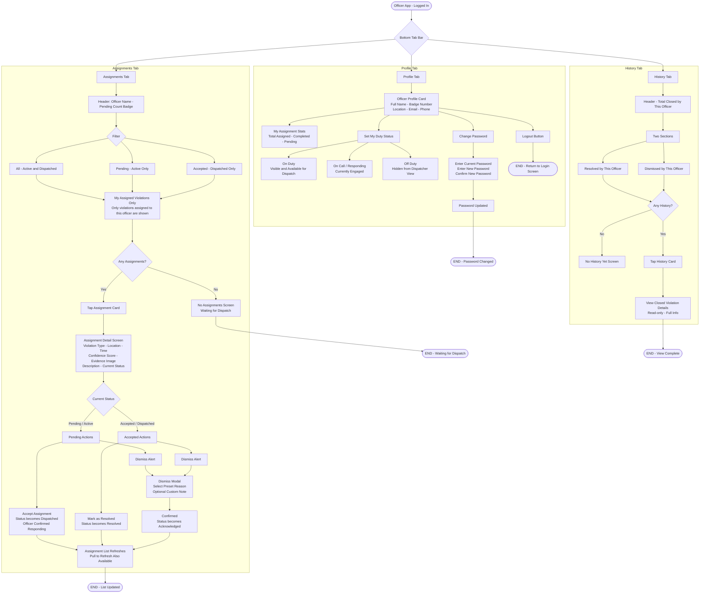
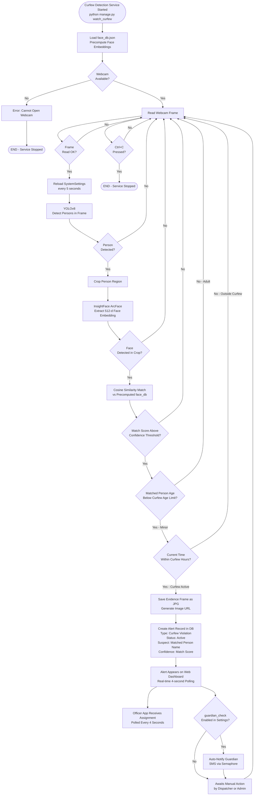
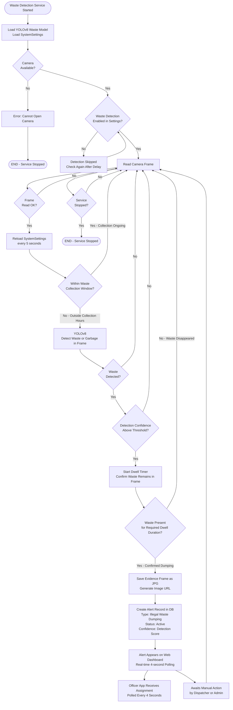
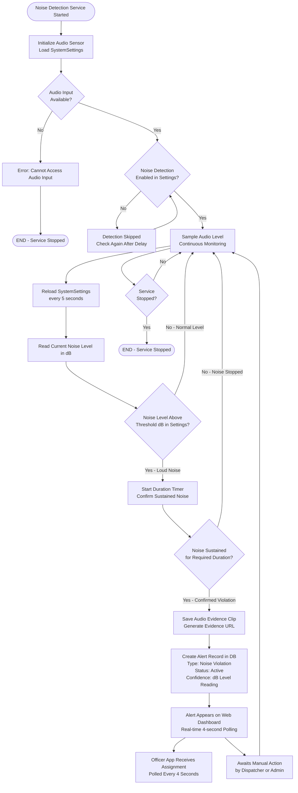

# LookOut System — Separate Flowcharts

---

## Diagram 1 — Authentication Flow

---

## Diagram 2 — Admin Web Dashboard

```mermaid
flowchart TD
    ADMIN_START([Admin Dashboard]) --> A_NAV{Sidebar Navigation}

    A_NAV --> A_OV[Overview]
    A_NAV --> A_LIVEFEEDS[Live Feeds]
    A_NAV --> A_VIO[Violations]
    A_NAV --> A_REC[Records]
    A_NAV --> A_RLOG[Resident Log]
    A_NAV --> A_RESI[Resident Database]
    A_NAV --> A_OFF[Officers and Personnel]
    A_NAV --> A_CFG[System Settings]

    subgraph A_OVERVIEW [Overview Page]
        A_OV --> A_KPI[KPI Cards\nActive Violations - Cameras Online\nOfficers on Duty - Total Alerts]
        A_OV --> A_FEEDPREV[Live Feeds Preview Panel\nShows Camera Thumbnails]
        A_OV --> A_RECENT[Recent Violations Panel]
        A_FEEDPREV --> A_VIEWALL{View All Button Clicked?}
        A_VIEWALL -->|Yes| A_LIVEFEEDS
        A_VIEWALL -->|No| A_FEEDPREV
    end

    subgraph A_LIVEFEEDS_PAGE [Live Feeds Page]
        A_LIVEFEEDS --> A_CGRID[Full Camera Grid\nAll Registered Cameras]
        A_CGRID --> A_CSTATUS{Camera Status}
        A_CSTATUS --> A_CONLINE[Online - Live Feed Visible]
        A_CSTATUS --> A_CDEG[Degraded - Partial Feed]
        A_CSTATUS --> A_COFF[Offline - No Feed]
    end

    subgraph A_VIOLATIONS_PAGE [Violations Page]
        A_VIO --> A_VFIL{Filter Tab}
        A_VFIL --> A_VALL[All Active]
        A_VFIL --> A_VACT[Active Only]
        A_VFIL --> A_VDSP[Dispatched Only]
        A_VALL & A_VACT & A_VDSP --> A_VCARD[Click Violation Card]
        A_VCARD --> A_VMOD[Violation Detail Modal\nEvidence - Location - Time\nConfidence - Officers Assigned]
        A_VMOD --> A_VSTATUS{Alert Status}

        A_VSTATUS -->|Active| A_VACT_A[Active Actions]
        A_VACT_A --> A_DISMISS[Dismiss Alert]
        A_VACT_A --> A_DISPATCH[Dispatch Officers]
        A_VACT_A --> A_CG1{Curfew Violation?}
        A_CG1 -->|Yes| A_GUARDIAN[Contact Guardian SMS]

        A_VSTATUS -->|Dispatched| A_VDSP_A[Dispatched Actions]
        A_VDSP_A --> A_REASSIGN[Reassign Officers]
        A_VDSP_A --> A_RESOLVE[Mark as Resolved]
        A_VDSP_A --> A_CG2{Curfew Violation?}
        A_CG2 -->|Yes| A_GUARDIAN

        A_DISMISS --> A_DMOD[Dismiss Modal\nSelect Reason + Optional Notes]
        A_DMOD --> A_DCONFIRM[Status becomes Acknowledged]

        A_DISPATCH --> A_DPMOD[Dispatch Modal\nSelect One or More Officers]
        A_DPMOD --> A_DPCONFIRM[Status becomes Dispatched\nOfficers Notified on App]

        A_RESOLVE --> A_RCHK[Resolve Checklist Modal\nAll Residents Listed\nFace Match Labeled Possible Candidate]
        A_RCHK --> A_RSEL[Select Involved Residents]
        A_RSEL --> A_RCONFIRM[Status becomes Resolved\nLinked to Resident Log]

        A_GUARDIAN --> A_GHHS[Search Households]
        A_GHHS --> A_GSEL[Select Phone Numbers to Notify]
        A_GSEL --> A_GMSG[Edit SMS Message]
        A_GMSG --> A_GSEND[Send SMS via Semaphore]
    end

    subgraph A_RECORDS_PAGE [Records Page]
        A_REC --> A_RFIL{Filter}
        A_RFIL --> A_RALL[All Closed]
        A_RFIL --> A_RRES[Resolved Only]
        A_RFIL --> A_RDIS[Dismissed Only]
        A_RALL & A_RRES & A_RDIS --> A_RSEARCH[Search by Type or Officer Name]
        A_RSEARCH --> A_RCARD[Click Record]
        A_RCARD --> A_RDETAIL[View Full Violation Details\nRead-only]
    end

    subgraph A_RESLOG_PAGE [Resident Log Page]
        A_RLOG --> A_RLLIST[All Tracked Residents List]
        A_RLLIST --> A_RLSEARCH[Search by Name or Barangay ID]
        A_RLSEARCH --> A_RLPERSON[Select Resident]
        A_RLPERSON --> A_RLPROFILE[Resident Violation Profile\nTotal Violation Count\nFull Violation History]
        A_RLPROFILE --> A_RLVIO[Click Violation Entry\nView Full Details]
    end

    subgraph A_RESIDENTS_PAGE [Resident Database Page]
        A_RESI --> A_RVIEW{View Mode}
        A_RVIEW --> A_RHHVIEW[Household List View]
        A_RVIEW --> A_RTABLE[Resident Table View]

        A_RHHVIEW --> A_ADDHH[Add Household Button]
        A_ADDHH --> A_HHMOD[Household Form\nFamily Name - Address - Purok\nZone - Contact - Enrolled Date]
        A_HHMOD --> A_HHSAVE[Household Saved]

        A_RHHVIEW --> A_HHEXP[Expand Household Card]
        A_HHEXP --> A_HMLIST[View Members List]
        A_HMLIST --> A_MEMADD[Add Member]
        A_MEMADD --> A_MEMMOD[Member Form\nName - Birthdate - Relation\nBarangay ID - Phone - Status]
        A_MEMMOD --> A_MEMSAVE[Member Saved]
        A_HMLIST --> A_MEMEDIT[Edit Member Info]
        A_HMLIST --> A_MEMENROLL[Enroll Face Button]
        A_MEMENROLL --> A_ENROLLMOD[Enrollment Modal\nUpload or Capture Face Photo]
        A_ENROLLMOD --> A_ENROLLSAVE[Face Enrolled in face_db\nUsed by Curfew AI Detection]
    end

    subgraph A_OFFICERS_PAGE [Officers and Personnel Page]
        A_OFF --> A_OTAB{Select Tab}
        A_OTAB --> A_OFFLIST[Officers List\nName - Badge - Status - Location]
        A_OTAB --> A_DISPLIST[Dispatchers List\nUsername - Email - Role]

        A_OFFLIST --> A_OFFREG[Register New Officer or Both Role]
        A_OFFREG --> A_OFFEMAIL[Enter Officer Email Address]
        A_OFFEMAIL --> A_OFFCODE[System Sends Verification Code to Email]
        A_OFFCODE --> A_OFFVERIFY[Admin Enters Code to Verify]
        A_OFFVERIFY --> A_OFFFORM[Fill Officer Details\nName - Badge - Location - Phone\nUsername - Password]
        A_OFFFORM --> A_OFFSAVE[Officer Account Created\nOfficer Logs In via Mobile App]
        A_OFFLIST --> A_OFFEDIT[Edit Officer Info\nStatus - Location - Badge]
        A_OFFLIST --> A_OFFDEL[Delete Officer Account]

        A_DISPLIST --> A_DISPAREG[Register Dispatcher]
        A_DISPAREG --> A_DISPAFORM[Fill Details\nName - Email - Username - Password - Role]
        A_DISPAFORM --> A_DISPASAVE[Dispatcher Account Created\nLogs In via Web Dashboard]
        A_DISPLIST --> A_DISPADEL[Delete Dispatcher Account]
    end

    subgraph A_SETTINGS_PAGE [System Settings Page]
        A_CFG --> A_CSEC{Settings Section}
        A_CSEC --> A_CCURFEW[Curfew Settings\nCurfew Hours - Age Limit\nAI Confidence Threshold\nGuardian Check - Unknown Person Alert]
        A_CSEC --> A_CNOISE[Noise Settings\nEnable or Disable\nNoise Threshold dB - Duration]
        A_CSEC --> A_CWASTE[Waste Settings\nEnable or Disable\nAI Confidence - Dwell Time\nCollection Window Hours]
        A_CSEC --> A_CSYSTEM[System Settings\nEvidence Retention Days\nAuto-Dispatch - Email Alerts - SMS Alerts]
        A_CCURFEW & A_CNOISE & A_CWASTE & A_CSYSTEM --> A_CSAVE[Save Settings]
        A_CSAVE --> A_CAPPLY[Settings Applied to Detection Pipelines]
        A_CCURFEW & A_CNOISE & A_CWASTE & A_CSYSTEM --> A_CRESET[Reset to Defaults]
    end

    A_NAV --> A_LOGOUT[Logout]
    A_LOGOUT --> END_ADMIN([END - Return to Web Login])
```

---

## Diagram 3 — Dispatcher Web Dashboard

---

## Diagram 4 — Officer Mobile App

---

## Diagram 5 — AI Curfew Detection Pipeline

---

## Diagram 6 — AI Garbage / Waste Detection Pipeline

---

## Diagram 7 — AI Noise Detection Pipeline

