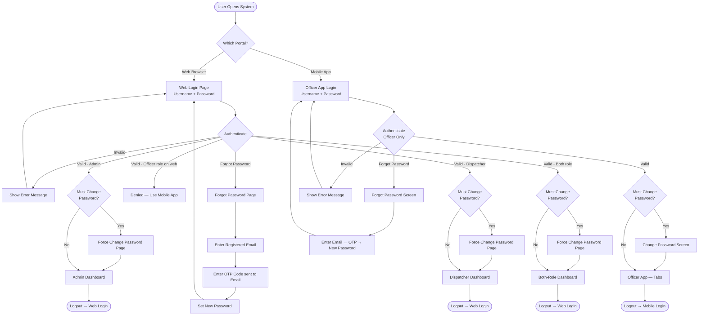
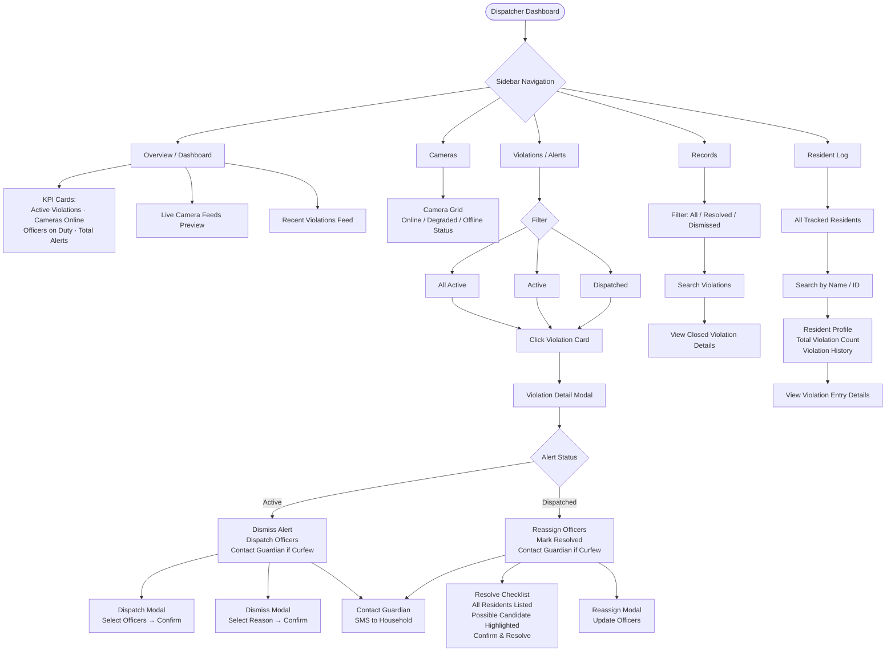
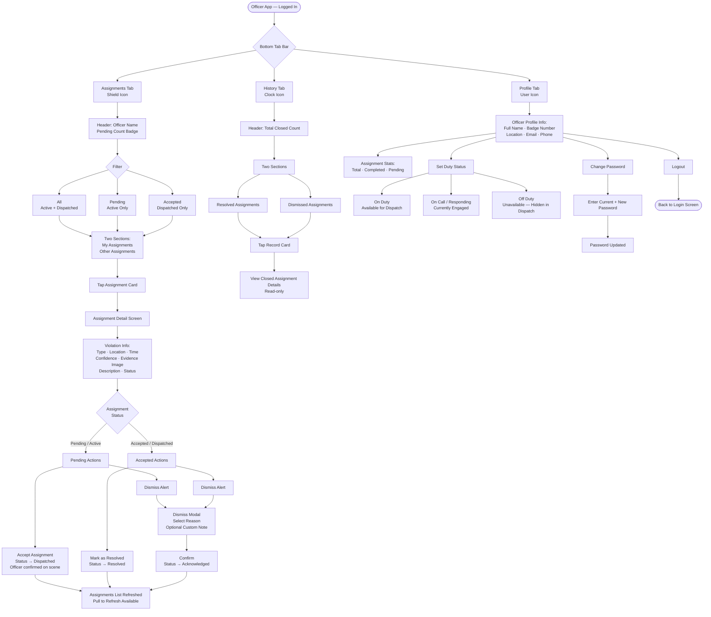
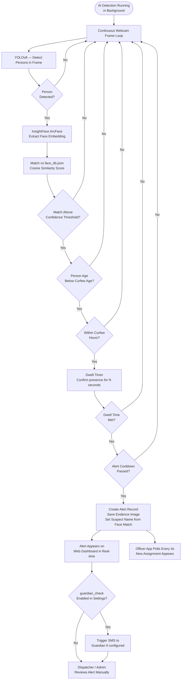

# LookOut Barangay Security System — Complete System Flowchart

---

## 1. Authentication Flow (All Portals)

---

## 2. Admin Web Dashboard — Full Flow

```mermaid
flowchart TD
    ADMIN_DASH([Admin Dashboard]) --> SIDEBAR{Sidebar Navigation}

    SIDEBAR --> PG_OVERVIEW[Overview / Dashboard]
    SIDEBAR --> PG_CAMERAS[Cameras]
    SIDEBAR --> PG_VIOLATIONS[Violations / Alerts]
    SIDEBAR --> PG_RECORDS[Records]
    SIDEBAR --> PG_RESLOG[Resident Log]
    SIDEBAR --> PG_RESIDENTS[Resident Database]
    SIDEBAR --> PG_OFFICERS[Officers & Personnel]
    SIDEBAR --> PG_CONFIG[System Settings]

    %% Overview Page
    PG_OVERVIEW --> OV_KPI[KPI Cards:\nActive Violations · Cameras Online\nOfficers on Duty · Total Alerts]
    PG_OVERVIEW --> OV_FEEDS[Live Camera Feeds Preview]
    PG_OVERVIEW --> OV_RECENT[Recent Violations Feed]
    OV_FEEDS --> PG_CAMERAS
    OV_RECENT --> PG_VIOLATIONS

    %% Cameras Page
    PG_CAMERAS --> CAM_GRID[Camera Grid\nAll registered cameras]
    CAM_GRID --> CAM_STATUS{Camera Status}
    CAM_STATUS --> CAM_ONLINE[Online — Live Feed]
    CAM_STATUS --> CAM_DEGRADE[Degraded — Partial Feed]
    CAM_STATUS --> CAM_OFFLINE[Offline — No Feed]

    %% Violations Page
    PG_VIOLATIONS --> VIO_FILTER{Filter Tab}
    VIO_FILTER --> VIO_ALL[All Active\nActive + Dispatched]
    VIO_FILTER --> VIO_ACTIVE[Active Only]
    VIO_FILTER --> VIO_DISP[Dispatched Only]

    VIO_ALL & VIO_ACTIVE & VIO_DISP --> VIO_CARD[Click Violation Card]
    VIO_CARD --> VIO_MODAL[Violation Detail Modal\nEvidence · Location · Time\nConfidence · Description\nAssigned Officers]

    VIO_MODAL --> VM_STATUS{Alert Status}

    VM_STATUS -->|Active| VM_ACT_ACTIONS[Active Actions]
    VM_ACT_ACTIONS --> VM_DISMISS[Dismiss Alert]
    VM_ACT_ACTIONS --> VM_DISPATCH[Dispatch Officers]
    VM_ACT_ACTIONS --> VM_CONTACT_ACT{Curfew Violation?}
    VM_CONTACT_ACT -->|Yes| VM_GUARDIAN[Contact Guardian\nSMS to household]

    VM_STATUS -->|Dispatched| VM_DSP_ACTIONS[Dispatched Actions]
    VM_DSP_ACTIONS --> VM_REASSIGN[Reassign Officers]
    VM_DSP_ACTIONS --> VM_RESOLVE[Mark as Resolved]
    VM_DSP_ACTIONS --> VM_CONTACT_DSP{Curfew Violation?}
    VM_CONTACT_DSP -->|Yes| VM_GUARDIAN

    VM_DISMISS --> DM_MODAL[Dismiss Modal\nSelect Reason\nOptional Notes]
    DM_MODAL --> DM_CONFIRM[Confirm Dismissal\nStatus → Acknowledged]

    VM_DISPATCH --> DISPATCH_MODAL[Dispatch Modal\nAvailable Officers List\nSelect Multiple Officers]
    DISPATCH_MODAL --> DSP_CONFIRM[Confirm Dispatch\nStatus → Dispatched\nOfficers Assigned]

    VM_RESOLVE --> RESOLVE_CHK[Resolve Checklist Modal\nAll Registered Residents Listed\nFace Recognition Match\nLabeled Possible Candidate]
    RESOLVE_CHK --> RES_SELECT[Check Involved Residents]
    RES_SELECT --> RES_CONFIRM[Confirm & Resolve\nStatus → Resolved\nViolation Linked to Resident Log]

    VM_GUARDIAN --> GDN_SEARCH[Search Households]
    GDN_SEARCH --> GDN_SELECT[Select Phone Numbers]
    GDN_SELECT --> GDN_MSG[Edit SMS Message]
    GDN_MSG --> GDN_SEND[Send SMS via Semaphore]

    %% Records Page
    PG_RECORDS --> REC_FILTER{Filter}
    REC_FILTER --> REC_ALL[All Closed]
    REC_FILTER --> REC_RESOLVED[Resolved Only]
    REC_FILTER --> REC_DISMISSED[Dismissed Only]
    REC_ALL & REC_RESOLVED & REC_DISMISSED --> REC_SEARCH[Search by Type / Name]
    REC_SEARCH --> REC_CARD[Click Record]
    REC_CARD --> REC_DETAIL[View Violation Detail Modal\nRead-only Evidence + Full Info]

    %% Resident Log Page
    PG_RESLOG --> RL_LIST[All Tracked Residents]
    RL_LIST --> RL_SEARCH[Search by Name / Barangay ID]
    RL_SEARCH --> RL_PERSON[Select Person]
    RL_PERSON --> RL_PROFILE[Resident Violation Profile\nTotal Violation Count\nViolation History List]
    RL_PROFILE --> RL_VIO[Click Violation Entry\nView Full Violation Details]

    %% Resident Database Page
    PG_RESIDENTS --> RES_VIEW{View Mode}
    RES_VIEW --> RES_HOUSEHOLDS[Household List View]
    RES_VIEW --> RES_TABLE[Resident Table View]

    RES_HOUSEHOLDS --> RES_ADD_HH[Add Household Button]
    RES_ADD_HH --> HH_MODAL[Add Household Modal\nFamily Name · Address · Purok\nZone · Contact · Enrolled Date]
    HH_MODAL --> HH_SAVE[Save Household]

    RES_HOUSEHOLDS --> HH_EXPAND[Expand Household Card]
    HH_EXPAND --> HH_MEMBER[View Members List]
    HH_MEMBER --> MEM_ADD[Add Member]
    MEM_ADD --> MEM_MODAL[Member Form\nFirst/Last Name · Birthdate\nRelation · Barangay ID\nPhone · Status]
    MEM_MODAL --> MEM_SAVE[Save Member]
    HH_MEMBER --> MEM_EDIT[Edit Member Info]
    HH_MEMBER --> MEM_ENROLL[Enroll Face]
    MEM_ENROLL --> ENROLL_MODAL[Enrollment Modal\nUpload / Capture Face Photo\nAdd to Face Database]
    ENROLL_MODAL --> ENROLL_SAVE[Face Saved to face_db.json\nUsed by AI Curfew Detection]

    %% Officers Page
    PG_OFFICERS --> OFF_TABS{Tab}
    OFF_TABS --> OFF_LIST[Officers List\nStatus · Badge · Location]
    OFF_TABS --> DISP_LIST[Dispatchers List\nUsername · Email · Role]

    OFF_LIST --> OFF_ADD[Register New Officer / Both]
    OFF_ADD --> OFF_EMAIL[Enter Officer Email]
    OFF_EMAIL --> OFF_CODE[Send Verification Code to Email]
    OFF_CODE --> OFF_VERIFY[Enter Code to Verify]
    OFF_VERIFY --> OFF_FORM[Fill Officer Details\nName · Badge · Location\nPhone · Username · Password]
    OFF_FORM --> OFF_SAVE[Officer Account Created\nCan Login via Mobile App]

    OFF_LIST --> OFF_EDIT[Edit Officer\nStatus · Location · Badge]
    OFF_LIST --> OFF_DELETE[Delete Officer]

    DISP_LIST --> DISP_ADD[Register Dispatcher]
    DISP_ADD --> DISP_FORM[Fill Dispatcher Details\nName · Email · Username · Password]
    DISP_FORM --> DISP_SAVE[Dispatcher Account Created\nCan Login via Web]
    DISP_LIST --> DISP_DELETE[Delete Dispatcher]

    %% System Config Page
    PG_CONFIG --> CFG_TABS{Settings Section}
    CFG_TABS --> CFG_CURFEW[Curfew Settings\nCurfew Hours · Age Limit\nAI Confidence Threshold\nDwell Time · Guardian Check\nUnknown Person Alert]
    CFG_TABS --> CFG_NOISE[Noise Settings\nEnable/Disable · Sensitivity\nDetection Duration]
    CFG_TABS --> CFG_WASTE[Waste Settings\nEnable/Disable · AI Confidence\nDwell Time · Collection Window]
    CFG_TABS --> CFG_SYSTEM[System Settings\nAlert Cooldown · Evidence Retention\nAuto-Dispatch · Email Alerts\nSMS Alerts]
    CFG_CURFEW & CFG_NOISE & CFG_WASTE & CFG_SYSTEM --> CFG_SAVE[Save Settings]
    CFG_SAVE --> CFG_APPLY[Settings Applied to\nAI Detection Pipeline]
    CFG_CURFEW & CFG_NOISE & CFG_WASTE & CFG_SYSTEM --> CFG_RESET[Reset to Defaults]
```

---

## 3. Dispatcher Web Dashboard — Full Flow

---

## 4. Officer Mobile App — Full Flow

---

## 5. AI Detection Pipeline — Background Flow

---

## Role & Page Access Summary

| Page / Feature | Admin | Dispatcher | Both | Officer (web) | Officer (mobile) |
|---|:---:|:---:|:---:|:---:|:---:|
| Overview Dashboard | ✅ | ✅ | ✅ | ❌ | ❌ |
| Live Cameras | ✅ | ✅ | ✅ | ✅ | ❌ |
| Violations / Alerts | ✅ | ✅ | ✅ | ✅ | ✅ (own) |
| Records | ✅ | ✅ | ✅ | ✅ | ❌ |
| Resident Log | ✅ | ✅ | ❌ | ❌ | ❌ |
| Resident Database | ✅ | ❌ | ❌ | ❌ | ❌ |
| Officers & Personnel | ✅ | ❌ | ❌ | ❌ | ❌ |
| System Settings | ✅ | ❌ | ❌ | ❌ | ❌ |
| Dispatch Officers | ✅ | ✅ | ✅ | ❌ | ❌ |
| Contact Guardian SMS | ✅ | ✅ | ✅ | ❌ | ❌ |
| Assignments (mobile) | ❌ | ❌ | ❌ | ❌ | ✅ |
| History (mobile) | ❌ | ❌ | ❌ | ❌ | ✅ |
| Duty Status Toggle | ❌ | ❌ | ❌ | ❌ | ✅ |
| Face Enrollment | ✅ | ❌ | ❌ | ❌ | ❌ |
| Register Officers | ✅ | ❌ | ❌ | ❌ | ❌ |
| Register Dispatchers | ✅ | ❌ | ❌ | ❌ | ❌ |
